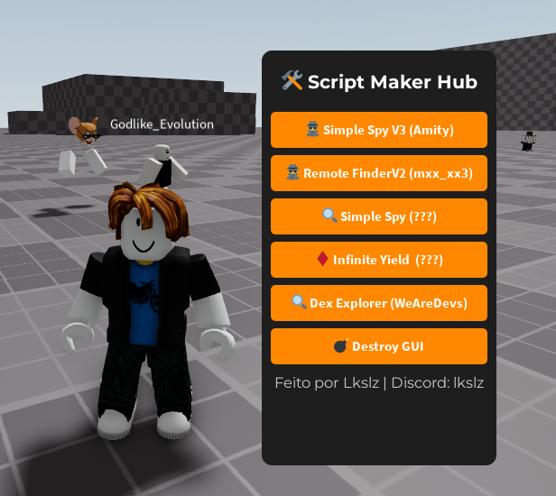

<h1 align="center">🛠️ Script Maker Hub</h1>
<p align="center">
  <b>Script Hub para Roblox - Código Aberto</b><br>
  Feito com 💙 por <a href="https://www.youtube.com/@LkslzScripts">Lkslz</a>
</p>

---

## 📌 Sobre

O **Script Maker Hub** é um hub visual feito em Lua para uso com executores no Roblox.  
Ele reúne **várias ferramentas úteis** para desenvolvedores, exploradores e scripters, como:

- 📡 Simple Spy (diversas versões)
- 🧠 Remote Finder
- ♾️ Infinite Yield
- 🔍 Dex Explorer
- 🧨 Botão para destruir o hub
- 🔑 Tecla `L` para esconder/mostrar a interface

É leve, rápido e pode ser usado em qualquer jogo.  
**Ideal para quem quer um hub funcional sem frescura.**

---
## 🚀 Executar via Loadstring

Cole este código no seu executor Roblox:

```lua
loadstring(game:HttpGet("https://raw.githubusercontent.com/Lukezinho1/Script-maker-hub/refs/heads/main/main.lua"))()
```
---

## 🧾 Licença

> Este script é de **uso livre** e **código aberto**.

Você pode:
- ✅ Copiar
- ✅ Modificar
- ✅ Compartilhar
- ❌ **Não** vender ou remover os créditos

Por favor, **mantenha os créditos do autor original** como forma de respeito.

---

## 👤 Autor

- 👨‍💻 **Feito por**: `Lkslz`
- 🎮 Discord: `lkslz`
- 📺 YouTube/TikTok: [@LkslzScripts](https://www.youtube.com/@LkslzScripts)

Se esse projeto te ajudou, **considere se inscrever no canal e deixar um like nos vídeos!**

---

## 💻 Como usar

1. Copie o script do arquivo `main.lua`
2. Cole no seu executor no Roblox
3. Execute dentro de qualquer jogo
4. Pressione a tecla `L` para mostrar ou esconder a interface
5. Clique nos botões para ativar as ferramentas

---

## 📷 Exemplo visual


